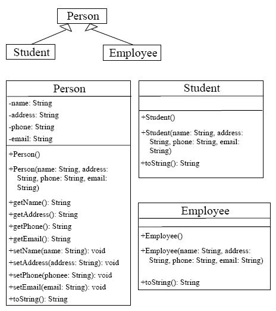
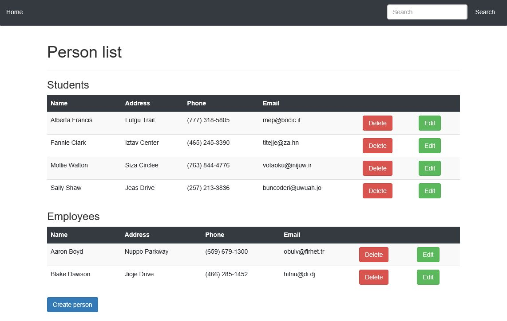
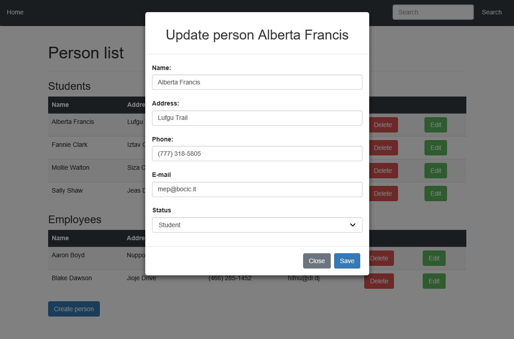
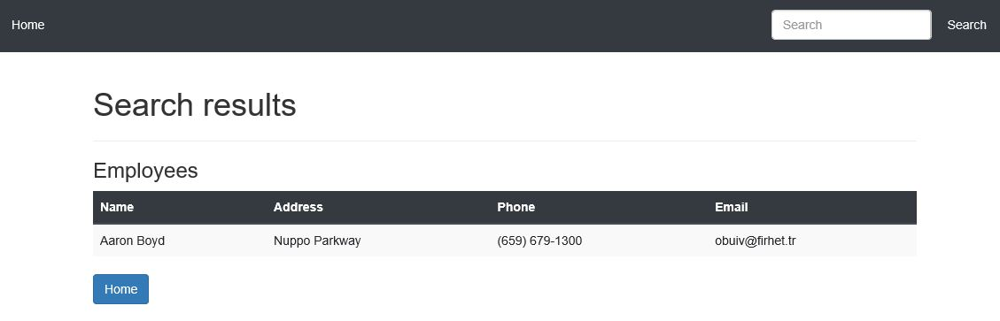

# Single Table Inheritance

## Description
This web application demonstrates work of single table inheritance strategy in JPA.

## Structure
There's one abstract class **Person** and two concrete classes: **Student** and **Employee**.

 

## Application
This application provides all CRUD operations for the records and allows to search by any field.

 

 

 

